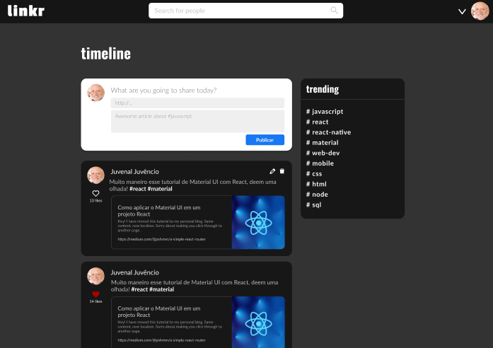
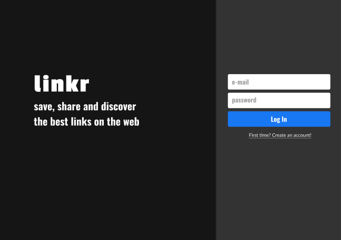
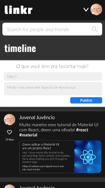

# Linkr

The complete layout of this project can be found in [Figma](https://www.figma.com/file/EzaDbiWc5y0qb8idmXQt0V/linkr-T4?type=design&node-id=0-1&mode=design&t=wuw4i0OCx0MwUlVZ-0)

## Overview

Full stack project of a link-sharing social network, in which the user can register, share links, and view links shared by other users, in addition to being able to like publications and comment, in addition to being able to search for users and view the most commented "#" on the social network.The project was carried out in a group of four people, during a bootcamp, and divided into two sprints.

## Technologies Used

* Javascript, React.js
* PostgreSQL ,Node.js, Express.js 
* uuid, bcrypt, joi, dotenv, axios

## Layout 

